# บทที่ 3: การวิเคราะห์และออกแบบระบบ (System Analysis and Design)

ในบทนี้จะอธิบายถึงรายละเอียดการออกแบบสถาปัตยกรรมระบบ ขอบเขตของกระบวนการทำงาน และโครงสร้างฐานข้อมูลของระบบ Velin Inventory & E-Commerce ซึ่งอ้างอิงจากขั้นตอนการทำงานเชิงลึก (Deep Technical Flow) และฐานข้อมูลจริง 11 ตาราง โดยมีเป้าหมายเพื่อความเป็นสากลและความปลอดภัยสูงสุด

---

## 1. แผนภาพบริบท (Context Diagram)

แสดงการไหลของข้อมูลที่แยกฝั่งผู้ใช้งานและผู้ดูแลระบบอย่างชัดเจนตามสถาปัตยกรรมจริง

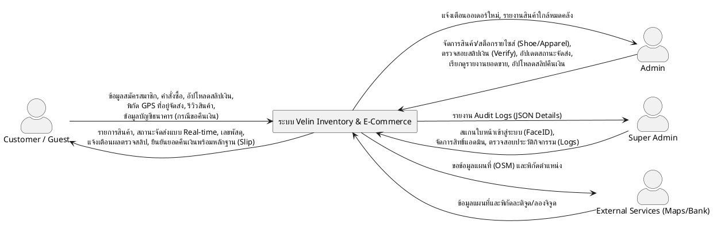

---

## 2. แผนภาพยูสเคส (Use Case Diagram)

แสดงฟังก์ชันการทำงานที่จัดลำดับตามความสำคัญ โดยมีแอดมินเป็นผู้ควบคุมการแจ้งสถานะจัดส่งและสมาชิกเป็นผู้ใช้งานหลัก

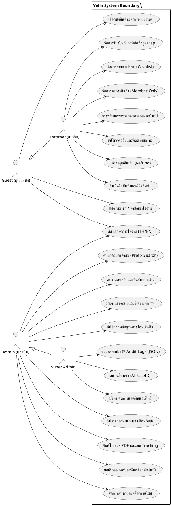

---

## 3. แผนภาพขั้นตอนการทำงาน (System Workflows)

### 3.1 Workflow: ลำดับขั้นตอนการสั่งซื้อหลัก (Swimlane)

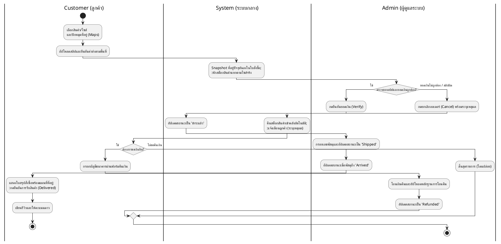

### 3.2 Workflow: การจัดการสิทธิ์และเข้าสู่ระบบด้วย AI FaceID (SuperAdmin Control)

แผนภาพแสดงขั้นตอนการลงทะเบียนข้อมูลใบหน้าโดย SuperAdmin และการเข้าใช้งานของแอดมินที่มีสิทธิ์ระดับสูงสุด

#### **3.2.1 ขั้นตอนการลงทะเบียนและแก้ไขใบหน้า (Enrolling & Editing)**
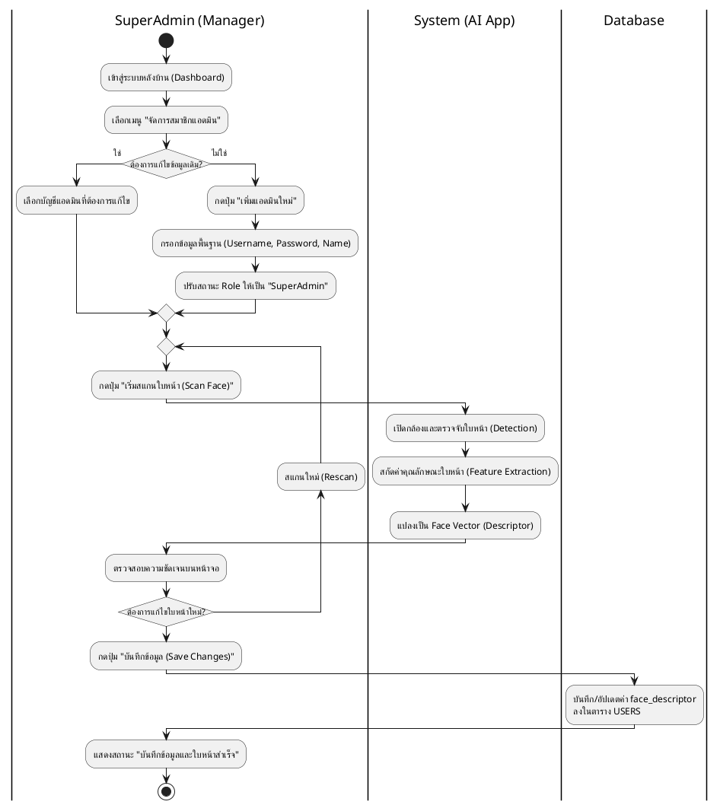

#### **3.2.2 ขั้นตอนการเข้าสู่ระบบด้วยใบหน้า (FaceID Login Flow)**
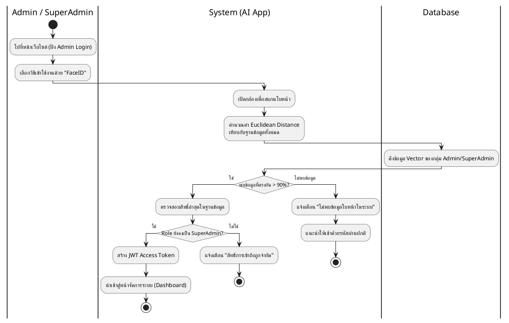

### 3.3 Workflow: การจัดการสินค้าและสต็อก (Admin Management)

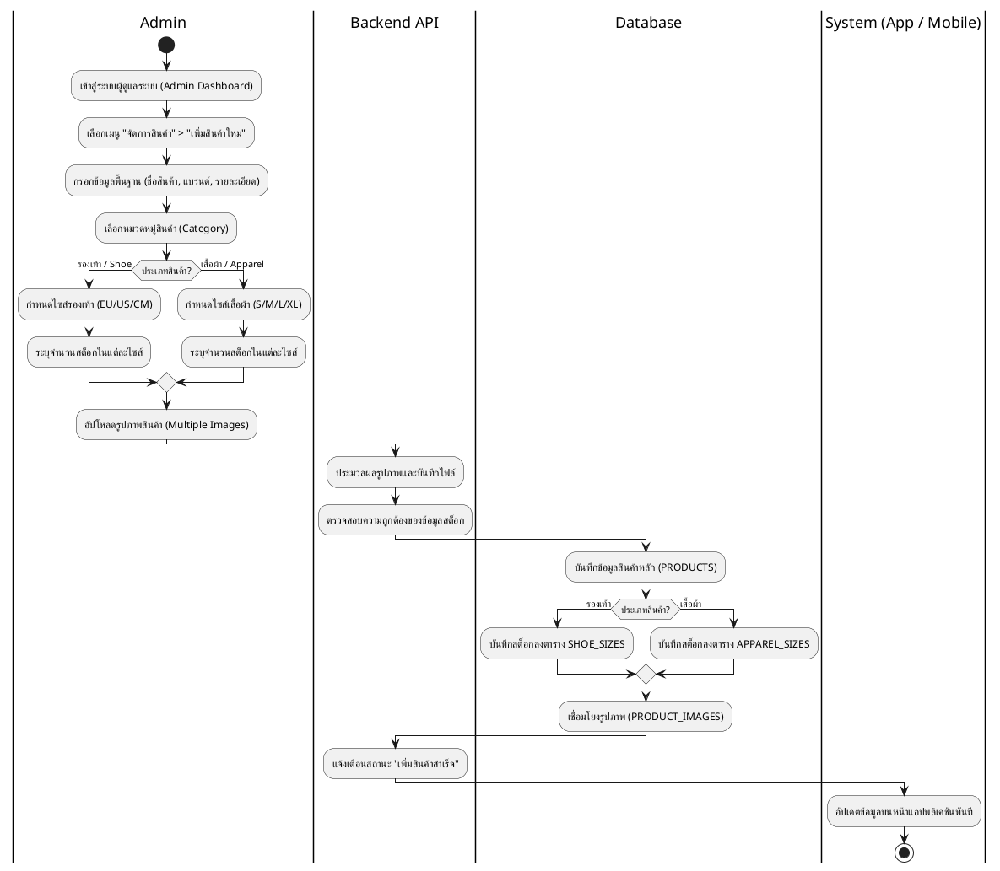

### 3.4 Workflow: การขอคืนเงิน (Refund Process)

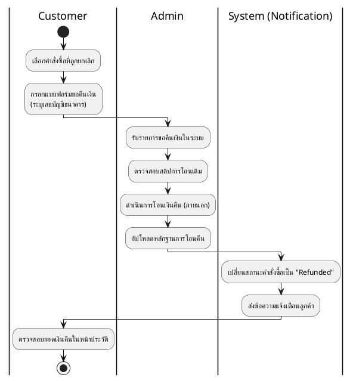

### 3.5 Workflow: การสมัครสมาชิกและจัดการพิกัดที่อยู่ (Customer Registration)

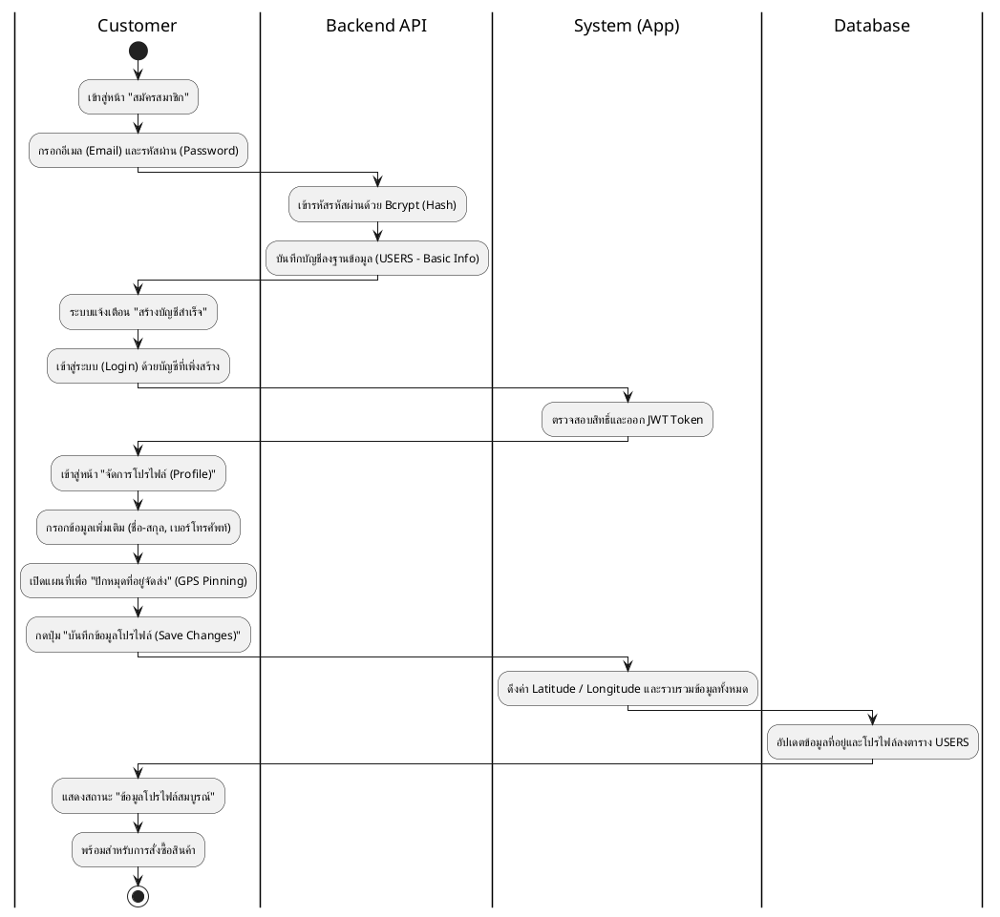

### 3.6 Workflow: การเลือกซื้อสินค้าและชำระเงิน (Shopping & Checkout)

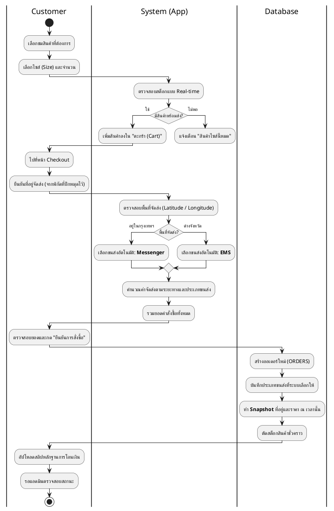

---

## 4. แผนภาพกระแสข้อมูลระดับ 0 (Data Flow Diagram - DFD Level 0)

แสดงการเชื่อมโยงข้อมูลระหว่างกระบวนการหลักและคลังข้อมูล (Data Stores)

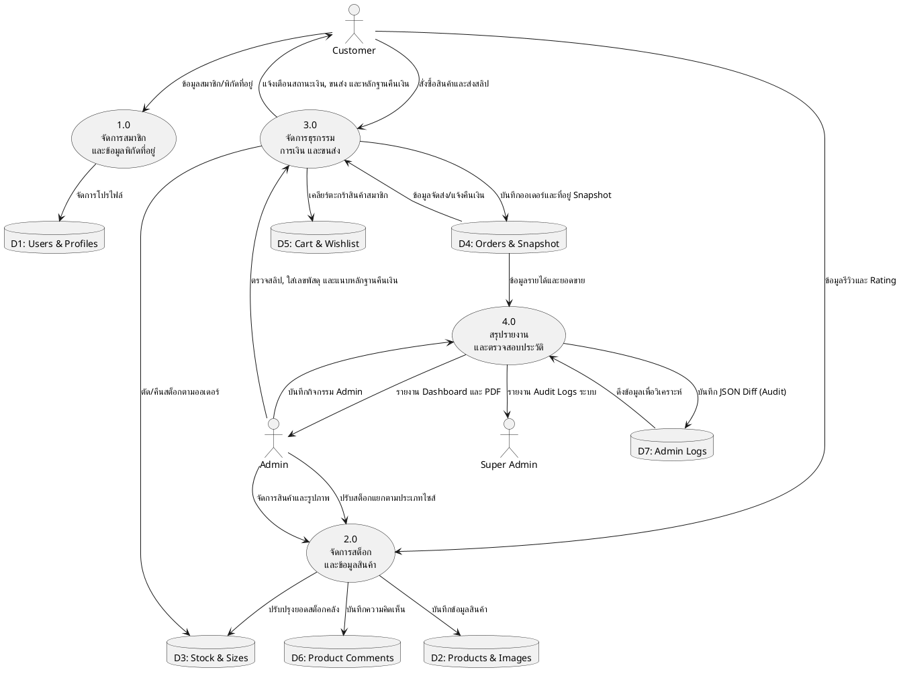

---

## 5. แผนภาพกระแสข้อมูลระดับ 1 (DFD Level 1)

### 5.1 ระบบการเงินและการขนส่ง

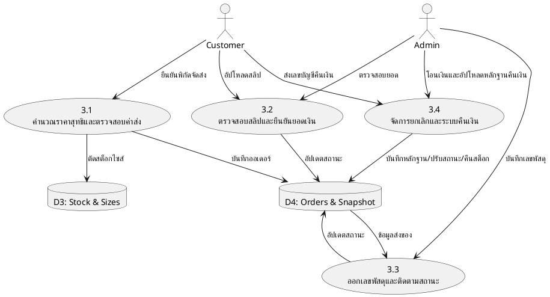

### 5.2 แผนภาพกระแสข้อมูลระดับ 1 (DFD Level 1) - ระบบจัดการข้อมูลสินค้า

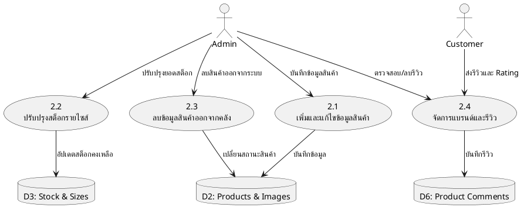

---

## 6. แผนภาพลำดับขั้นตอน (Sequence Diagrams)

แสดงการปฏิสัมพันธ์ระหว่าง Frontend, Backend และ Database แบบ Real-time

### 6.1 ขั้นตอนการตรวจสอบสลิปเงินอัตโนมัติ

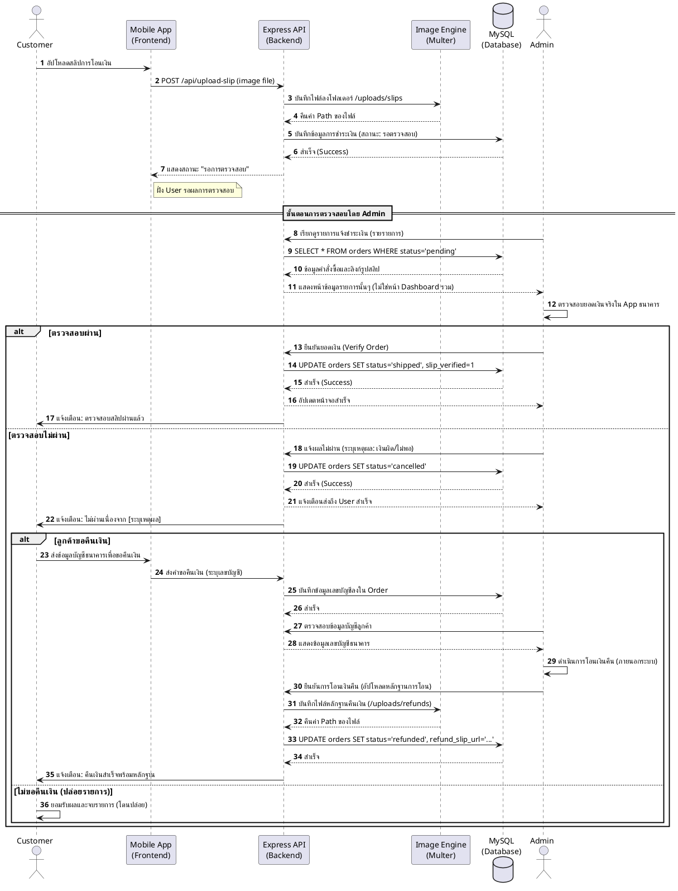

### 6.2 ขั้นตอนการทำงานของ AI FaceID (Enrollment & Auth Sequence)

แสดงลำดับการรับส่งข้อมูลระหว่างการลงทะเบียนโดย SuperAdmin และการตรวจสอบสิทธิ์

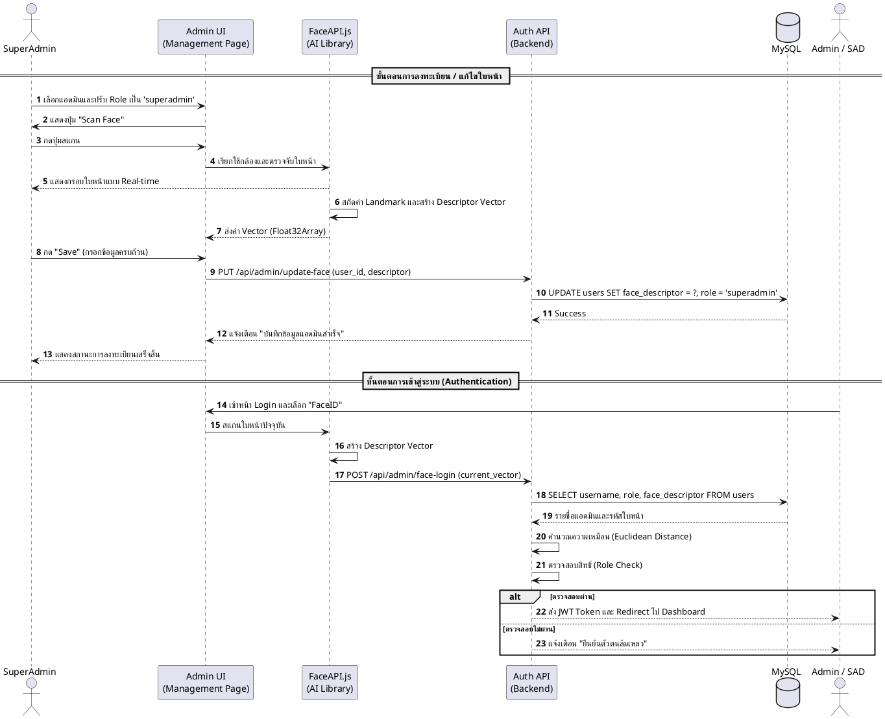

---

## 7. แผนภาพความสัมพันธ์ของเอนทิตี (Entity Relationship Diagram - ERD)

โครงสร้างฐานข้อมูล 11 ตารางที่ออกแบบมาเพื่อความปลอดภัย (Normalization 3NF) และรองรับประวัติข้อมูล (Data Snapshots)

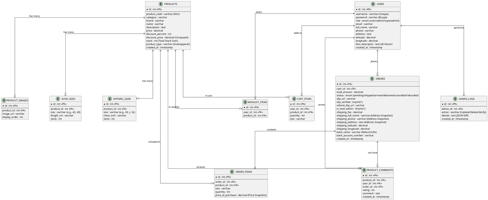

---

## 8. พจนานุกรมข้อมูล (Data Dictionary)

รายละเอียดโครงสร้างข้อมูลเชิงลึก (Deep Technical Specification) เพื่อความแม่นยำในการพัฒนาระบบ

### 8.1 กลุ่มข้อมูลผู้ใช้งาน (User & Security)
| Field | Type | Constraint | Description |
|---|---|---|---|
| id | int | PK, AI | รหัสประจำตัวผู้ใช้ (Unique Identifier) |
| face_descriptor | text | Nullable | ข้อมูล Face Vector สำหรับ AI FaceID Login |
| role | enum | Default: 'user' | สิทธิ์การใช้งาน (user, admin, superadmin) |

### 8.2 กลุ่มข้อมูลสินค้าและสต็อก (Product & Inventory)
| Field | Type | Constraint | Description |
|---|---|---|---|
| product_type | varchar | Not Null | ตัวแยกประเภทสินค้า ('shoe' หรือ 'apparel') |
| discount_price | decimal | Computed | ราคาที่คำนวณส่วนลดแล้ว เพื่อความเร็วในการดึงข้อมูล |
| size (sizes table)| varchar | FK | ขนาดสินค้าที่เชื่อมโยงกับตารางไซส์ที่ถูกต้อง |

### 8.3 กลุ่มข้อมูลธุรกรรม (Transaction & Snapshots)
| Field | Type | Constraint | Description |
|---|---|---|---|
| shipping_address | text | **Snapshot** | เก็บที่อยู่ ณ เวลาที่สั่งซื้อจริง (ไม่เปลี่ยนตามโปรไฟล์) |
| price_at_purchase| decimal | **Snapshot** | เก็บราคา ณ เวลาที่ซื้อ เพื่อป้องกันปัญหาเมื่อราคาสินค้าเปลี่ยน |
| refund_slip_url | varchar | Nullable | เก็บ Path ของหลักฐานสลิปการโอนเงินคืนให้ลูกค้า |
| is_read_admin | tinyint | Default: 0 | ระบบแจ้งเตือนแอดมินเมื่อมีออเดอร์ใหม่ |

### 8.4 กลุ่มข้อมูลตรวจสอบ (Audit Logs)
| Field | Type | Constraint | Description |
|---|---|---|---|
| details | text | JSON | เก็บความเปลี่ยนแปลงของข้อมูลในรูปแบบ JSON Diff |

> [!IMPORTANT]
> ระบบฐานข้อมูลถูกออกแบบมาให้รองรับ **Data Integrity** สูงสุด โดยใช้ Snapshot Logic เพื่อให้ประวัติการสั่งซื้อ (History) ไม่ได้รับผลกระทบจากการเปลี่ยนแปลงข้อมูลพื้นฐานในอนาคต
